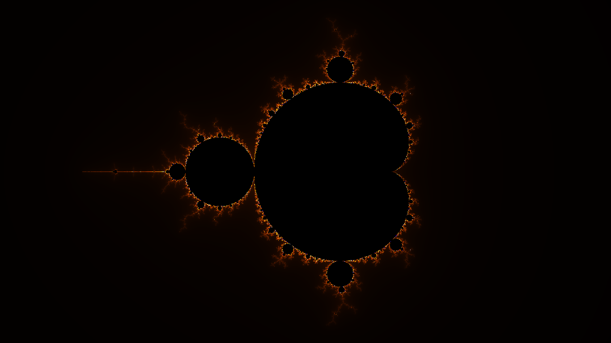

# Fractage Documentation

## Endpoints

All query parameters are optional.

### Fractals

### Cantor Dust

```yaml
http://localhost:6060/cantor-dust
```

#### Parameters

+ **iterations:**
  + _Definition:_ The number of iterations that should be displayed.
  + _Type:_ [Integer](#integer-type)
  + _Range:_ 0 to 25 inclusive.
  + _Default:_ 5
+ **color:**
  + _Definition:_ The color for drawing the boxes.
  + _Type:_ [Color](#color-type)
  + _Default:_ random colors.

#### Sample


### Cantor Set

```yaml
http://localhost:6060/cantor-set
```

#### Parameters

+ **iterations:**
  + _Definition:_ The number of iterations that should be displayed.
  + _Type:_ [Integer](#integer-type)
  + _Range:_ 0 to 25 inclusive.
  + _Default:_ 5
+ **line_height:**
  + _Definition:_ The height of each line.
  + _Type:_ [Integer](#integer-type)
  + _Range:_ 0 to 30 inclusive.
  + _Default:_ 5
+ **color:**
  + _Definition:_ The color for drawing the lines.
  + _Type:_ [Color](#color-type)
  + _Default:_ random colors.

#### Sample


### Hopalong

```yaml
http://localhost:6060/hopalong
```

#### Parameters

+ **resolution:**
  + _Definition:_ The resolution for each pixel.
  + _Type:_ [Integer](#integer-type)
  + _Range:_ 0 to 5,000 inclusive.
  + _Default:_ 5
+ **a:**
  + _Definition:_ The value of the variable $a$ in the hopalong function.
  + _Type:_ [Float](#float-type)
  + _Default:_ 5
+ **b:**
  + _Definition:_ The value of the variable $b$ in the hopalong function.
  + _Type:_ [Float](#float-type)
  + _Default:_ 1
+ **c:**
  + _Definition:_ The value of the variable $c$ in the hopalong function.
  + _Type:_ [Float](#float-type)
  + _Default:_ 5
+ **d:**
  + _Definition:_ The value of the variable $d$ in the hopalong function.
  + _Type:_ [Float](#float-type)
  + _Default:_ 0
+ **x:**
  + _Definition:_ The starting value of $x$ in the hopalong function.
  + _Type:_ [Float](#float-type)
  + _Default:_ -1
+ **y:**
  + _Definition:_ The starting value of $y$ in the hopalong function.
  + _Type:_ [Float](#float-type)
  + _Default:_ 0
+ **scale:**
  + _Definition:_ The scale of the image displayed.
  + _Type:_ [Float](#float-type)
  + _Default:_ 5
+ **type:**
  + _Definition:_ The type of hopalong to function to use.
  + _Type:_ `Enum`
    + `classic_bm` -> The classic Barry Martin hopalong.
    + `positive_bm` -> The positive Barry Martin hopalong.
    + `additive_bm` -> The additive Barry Martin hopalong.
    + `gingerbread_man` -> The gingerbread man hopalong.
  + _Default:_ `classic_bm`
+ **color:**
  + _Definition:_ The color for coloring the pixels.
  + _Type:_ [Color](#color-type)
  + _Default:_ random color.

#### Sample


### Iterated Function System

```yaml
http://localhost:6060/ifs
```

#### Parameters

+ **variables:**
  + _Definition:_ The value of the variables $a$, $b$, $c$, $d$, $e$, $f$, and $probability$ for each set of the iterated function system of the functions $x_{n + 1} = ax_n + by_n + e$ and $y_{n + 1} = cx_n + dy_n + f$. The first 7 values belong to the first set, the next 7 values belong to the second set, and the $n^\mathrm{th}$ 7 values belong to the $n^\mathrm{th}$ set.
  + _Type:_ A $7n$ array of [Float](#float-type)s, where $n$ is an integer greater than $0$.
  + _Default:_ 0.0,0.0,0.0,0.16,0.0,0.0,0.01, 0.2,-0.26,0.23,0.22,0.0,1.6,0.07, -0.15,0.28,0.26,0.24,0.0,0.44,0.07, 0.85,0.04,-0.04,0.85,0.0,1.6,0.85
+ **x:**
  + _Definition:_ The horizontal displacement of the image. Can be overwritten by the `focus` parameter.
  + _Type:_ [Float](#float-type)
  + _Default:_ 0
+ **y:**
  + _Definition:_ The vertical displacement of the image. Can be overwritten by the `focus` parameter.
  + _Type:_ [Float](#float-type)
  + _Default:_ 0
+ **scale:**
  + _Definition:_ The scale of the image to display. Can be overwritten by the `focus` parameter.
  + _Type:_ [Float](#float-type)
  + _Range_:_ 0 to 50,000 inclusive.
  + _Default:_ 1
+ **focus:**
  + _Definition:_ Specifies if the points should be brought to the center of the image. Can overwrite the effect of the `x`, `y`, and `scale` parameters.
  + _Type:_ [Boolean](#boolean-type)
  + _Default:_ true
+ **iterations:**
  + _Definition:_ The number of points to draw.
  + _Type:_ [Integer](#integer-type)
  + _Range:_ 0 to 5,000,000,000 inclusive.
  + _Default:_ 500,000
+ **color:**
  + _Definition:_ The color for coloring the points in each set. This is used for giving the points a uniform color and can be overwritten by the `colors` parameter.
  + _Type:_ [Color](#color-type)
  + _Default:_ random color.
+ **colors:**
  + _Definition:_ The color for coloring each set of points. This is used for assigning a unique color to the points that belong under a set of variables. Invalid colors are ignored and a random colour is used as a replacement. A random colour is also assigned to a set if there are an insufficient number of colours for the set of variables that were specified.
  + _Type:_ A comma-separated list of [Color](#color-type)s.
  + _Default:_ `mahogany, mahogany, mahogany, mahogany`

#### Sample


### Julia Set

```yaml
http://localhost:6060/julia-set
```

#### Parameters

+ **iterations:**
  + _Definition:_ The maximum number of iterations that should be performed for each pixel.
  + _Type:_ [Integer](#integer-type)
  + _Range:_ 0 to 500,000 inclusive.
  + _Default:_ 250
+ **c:**
  + _Definition:_ The value of $c$ in the equation $z = z^2 + c$.
  + _Type:_ [Complex](#complex-type)
  + _Default:_ $-0.5 + 0.6i$
+ **bail_out:**
  + _Definition:_ The value at which the series diverges.
  + _Type:_ [Float](#float-type)
  + _Default:_ 2
+ **region:**
  + _Definition:_ The region of the infinite plane to display.
  + _Type:_ [Rectangle](#rectangle-type)
  + _Default:_ -1.5, -1.5, 3, 3
+ **type:**
  + _Definition:_ The type of series to display.
  + _Type:_ `Enum`
    + `classic`: The classic Julia set. Values are generated from the series $z_{n + 1} = z_n^2 + c$.
    + `lace`: The lace Julia set. Values are generated from the series $z_{n + 1} = \frac{iz_n^{-3} + 1010}{ciz_n^{-6} + 3301z_n}$, where $i, i \in \mathbb{C}$ is a variable.
    + `phoenix`: The phoenix Julia set. Values are generated from the series $z_{n + 1} = z_n^2 + c + kz_{n - 1}$, where $k, k \in \mathbb{C}$ is a variable.
    + `csin`: Values are generated from the series $z_{n + 1} = c\sin(z_n)$.
    + `ccos`: Values are generated from the series $z_{n + 1} = c\cos(z_n)$.
    + `ctan`: Values are generated from the series $z_{n + 1} = c\tan(z_n)$.
    + `abs_sin4`: Values are generated from the series $z_{n + 1} = \mathrm{abs}(\sin^4(z_n)) + c$, where $\mathrm{abs}$ is calculated as $\mathrm{abs}(3) + \mathrm{abs}(-2)$ for the complex number $3-2i$.
    + `abs_cos4`: Values are generated from the series $z_{n + 1} = \mathrm{abs}(\cos^4(z_n)) + c$, where $\mathrm{abs}$ is calculated as $\mathrm{abs}(3) + \mathrm{abs}(-2)$ for the complex number $3-2i$.
    + `abs_tan4`: Values are generated from the series $z_{n + 1} = \mathrm{abs}(\tan^4(z_n)) + c$, where $\mathrm{abs}$ is calculated as $\mathrm{abs}(3) + \mathrm{abs}(-2)$ for the complex number $3-2i$.
    + `abs_cot4`: Values are generated from the series $z_{n + 1} = \mathrm{abs}(\cot^4(z_n)) + c$, where $\mathrm{abs}$ is calculated as $\mathrm{abs}(3) + \mathrm{abs}(-2)$ for the complex number $3-2i$.
    + `abs_sinh4`: Values are generated from the series $z_{n + 1} = \mathrm{abs}(\sinh^4(z_n)) + c$, where $\mathrm{abs}$ is calculated as $\mathrm{abs}(3) + \mathrm{abs}(-2)$ for the complex number $3-2i$.
    + `abs_cosh4`: Values are generated from the series $z_{n + 1} = \mathrm{abs}(\cosh^4(z_n)) + c$, where $\mathrm{abs}$ is calculated as $\mathrm{abs}(3) + \mathrm{abs}(-2)$ for the complex number $3-2i$.
    + `abs_tanh4`: Values are generated from the series $z_{n + 1} = \mathrm{abs}(\tanh^4(z_n)) + c$, where $\mathrm{abs}$ is calculated as $\mathrm{abs}(3) + \mathrm{abs}(-2)$ for the complex number $3-2i$.
    + `abs_asinh4`: Values are generated from the series $z_{n + 1} = \mathrm{abs}(\mathrm{asinh}^4(z_n)) + c$, where $\mathrm{abs}$ is calculated as $\mathrm{abs}(3) + \mathrm{abs}(-2)$ for the complex number $3-2i$.
    + `abs_acosh4`: Values are generated from the series $z_{n + 1} = \mathrm{abs}(\mathrm{acosh}^4(z_n)) + c$, where $\mathrm{abs}$ is calculated as $\mathrm{abs}(3) + \mathrm{abs}(-2)$ for the complex number $3-2i$.
    + `abs_atanh4`: Values are generated from the series $z_{n + 1} = \mathrm{abs}(\mathrm{atanh}^4(z_n)) + c$, where $\mathrm{abs}$ is calculated as $\mathrm{abs}(3) + \mathrm{abs}(-2)$ for the complex number $3-2i$.
  + _Default:_ `classic`
+ **variables:**
  + _Definition:_ A comma-separated list of variable assignments.
  + _Type:_ A list of [VariableAssignments](#variable-assignment-type).
  + _Default:_ `i=3+0i`
+ **color_palette:**
  + _Definition:_ The color palette for coloring the pixels.
  + _Type:_ [ColorPalette](#color-palette-type)
  + _Default:_ `multi_colored`

#### Sample


### Mandelbrot Set

```yaml
http://localhost:6060/mandelbrot-set
```

#### Parameters

+ **iterations:**
  + _Definition:_ The maximum number of iterations that should be performed for each pixel.
  + _Type:_ [Integer](#integer-type)
  + _Range:_ 0 to 500,000 inclusive.
  + _Default:_ 700
+ **m:**
  + _Definition:_ The value of $m$ in $z_{n + 1} = z_n^m + z_0$.
  + _Type:_ [Float](#float-type)
  + _Default:_ 2
+ **bail_out:**
  + _Definition:_ The value for which $|z|$ belongs to the fractal pattern. $|z|$ must be less than $\mathrm{bail\_out}^m$ for the value of $z$ to belong to the fractal pattern.
  + _Type:_ [Float](#float-type)
  + _Default:_ 20
+ **region:**
  + _Definition:_ The region of the infinite plane to display.
  + _Type:_ [Rectangle](#rectangle-type)
  + _Default:_ -2, -1.25, 3.25, 2.5
+ **color_palette:**
  + _Definition:_ The color palette for coloring the pixels.
  + _Type:_ [ColorPalette](#color-palette-type)
  + _Default:_ `orange_blue`

#### Sample



### Newton Basin

```yaml
http://localhost:6060/newton-basin
```

#### Parameters

+ **iterations:**
  + _Definition:_ The maximum number of iterations that should be performed for each pixel.
  + _Type:_ [Integer](#integer-type)
  + _Range:_ 0 to 500,000 inclusive.
  + _Default:_ 32
+ **polynomial:**
  + _Definition:_ The equation whose solution is to be found using the Newton-Raphson method.
  + _Type:_ [Polynomial](#polynomial-type)
  + _Default:_ `-1+x^5` ($-1+x^5$)
+ **bail_out:**
  + _Definition:_ The value for which $|z|$ belongs to the fractal pattern. $|z|$ must be less than `bail_out` for the value of $z$ to belong to the fractal pattern.
  + _Type:_ [Float](#float-type)
  + _Default:_ $1e15$
+ **region:**
  + _Definition:_ The region of the infinite plane to display.
  + _Type:_ [Rectangle](#rectangle-type)
  + _Default:_ -2, -1.5, 4, 3
+ **color_palette:**
  + _Definition:_ The color palette for coloring the pixels.
  + _Type:_ [ColorPalette](#color-palette-type)
  + _Default:_ A dynamic set of colors.

#### Sample


### Sierpinski Carpet

```yaml
http://localhost:6060/sierpinski-carpet
```

#### Parameters

+ **iterations:**
  + _Definition:_ The number of iterations that should be displayed.
  + _Type:_ [Integer](#integer-type)
  + _Range:_ 0 to 25 inclusive.
  + _Default:_ 5
+ **color:**
  + _Definition:_ The color for drawing the boxes.
  + _Type:_ [Color](#color-type)
  + _Default:_ random colors.

#### Sample


### Sierpinski Triangle

```yaml
http://localhost:6060/sierpinski-triangle
```

#### Parameters

+ **iterations:**
  + _Definition:_ The number of iterations that should be displayed.
  + _Type:_ [Integer](#integer-type)
  + _Range:_ 0 to 25 inclusive.
  + _Default:_ 5
+ **color:**
  + _Definition:_ The color for drawing the triangles.
  + _Type:_ [Color](#color-type)
  + _Default:_ random colors.

#### Sample


## Type Definitions

### Integer Type

**Format:** `(+|-)?[0-9]+`<br/>
**Definition:** A 64-bit signed integer.<br/>
**Alias:** `<int>`<br/>
**Example:** `768`

### Float Type

**Format:** `(+|-)?[0-9]+(.[0-9]+)?`<br/>
**Definition:** A 64-bit floating or fractional number.<br/>
**Alias:** `<float>`<br/>
**Example:** `7.68`

### Complex Type

**Format:** `<float>([+-]<float>i)?`<br/>
**Definition:** A complex number consisting of 64-bit floating point real and imaginary parts. If there's a sign, there should be no spaces around it.<br/>
**Alias:** `<cmplx>`<br/>
**Example:** `7.68+3i`

### Boolean Type

**Format:** `(1|t|T|TRUE|true|True)` for the value of `true` or `(0|f|F|FALSE|false|False)` for the value of `false`<br/>
**Definition:** A true or false value.<br/>
**Alias:** `<bool>`<br/>
**Example:** `false`

### Color Type

**Alias:** `<color>`

#### Variant 1

**Format:** `rgb(<int>, <int>, <int>)` or `rgba(<int>, <int>, <int>, <int>)`<br/>
**Definition:** A color defined using the `rgb` or `rgb` format, where the `<int>` values are in the range 0-255 inclusive.<br/>
**Example:** `rgb(125, 25, 35)`

#### Variant 2

**Format:** `#[0-9a-f]+`<br/>
**Definition:** A color defined using the hexa-decimal format, where the values are integers in the range 0-255 inclusive but written in the hexa-decimal format.<br/>
**Example:** `#2233aa` or `#23a`

#### Variant 3

**Format:** `[a-zA-Z_]+`<br/>
**Definition:** A named color that has been defined in [colors.yaml](src/data/colors.yaml).<br/>
**Example:** `slategray`

### Rectangle Type

**Alias:** `<rect>`

#### Variant 1

**Format:** `<float>, <float>, <float>, <float>`<br/>
**Definition:** 4 comma-separated float values representing the _x_ position, _y_ position, _width_ and _height_ of a rectangular area.<br/>
**Example:** `1.13, 2, 9.8, 7`

#### Variant 2

**Format:** `<float>, <float>`<br/>
**Definition:** 2 comma-separated float values representing the _width_ and _height_ of a rectangular area. The _x_ and _y_ positions would be 0.<br/>
**Example:** `7.68, 7.86`

### Polynomial Type

**Format:** `(<float>([a-zA-Z](^<int>)?)?)+`<br/>
**Definition:** A simple polynomial expression.<br/>
**Alias:** `<poly_expr>`<br/>
**Example:** `3 + 2.3x - x^5` for $3 + 2.3x - x^5$

### Color Palette Type

**Alias:** `<color_palette>`

#### Variant 1

**Format:** `[a-zA-Z_]+`<br/>
**Definition:** A named color palette that has been defined in [color_palettes.yaml](src/data/color_palettes.yaml).<br/>
**Example:** `orange_blue`

#### Variant 2

**Format:** `("<color>", <float>,)+`<br/>
**Defininition:** A comma-separated list of colors and positions in increasing order. Each position has to be a `<float>` type in the range of 0 to 1 inclusive. Colors defined using the `rgb` format should be enclosed in double quotes.<br/>
**Example:** `slategray, 0.0, %23808080, 0.45, %22rgb(200, 200, 200)%22, 1.0`
