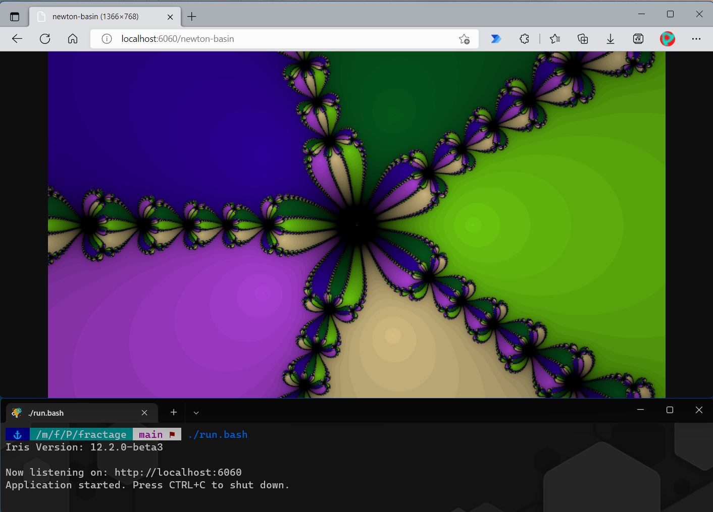

# Fractage

[](https://github.com/yishakk/fractage/actions/workflows/build.yaml)

Fractage is a fractal image generation service written in Golang.



## Requirements

+ Go (version 1.18+)

## How To Use

### Via Local Terminal

Clone this repository and run the command below using your Linux/WSL terminal. Uninstalled modules would be downloaded on your system before the program starts during the first run.

```powershell
./run.bash
```

### Via Docker

Run the command below.

``` powershell
docker run -d -p 6060:6060 yishakkibru/fractage
```

See [Documentation](DOCUMENTATION.md) for more details about the supported fractals and endpoints.

## Related Projects

+ [BeautifulFractals](https://github.com/alex-titarenko/beautifulfractals)
